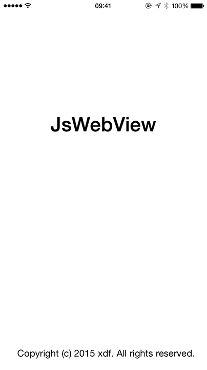

swifty-webview
==============

## Preview



## Configuration

```swift
let viewController = WebviewController(urlString: "TEST", title: "test", autoLoad: false)
self.window?.rootViewController = UINavigationController(rootViewController: viewController)
        
viewController.startLoad()
```

## Usage

```js
var $ = function(selector) {
  var res = document.querySelectorAll(selector);
  if (res.length > 1) {
    return res;
  }
  return document.querySelector(selector);
};

$('#userAgent').innerHTML = navigator.userAgent;
$('#cookie').innerHTML = document.cookie;

var init = function() {
  var buttons = $('button');

  for (var i = 0; i < buttons.length; i++) {
    buttons[i].addEventListener('click', function(e) {
      var target = e.target;
      var data = target.getAttribute('data')
      JsBridge.call(target.id, JSON.parse(data), function() {
      });
    }, false);
  }
  
  JsBridge.call('setTitle', {
    title: 'test ' + new Date().getMinutes() + 'min ' + new Date().getSeconds() + 's'
  }, function() {
  });
};

document.addEventListener('JSBridgeReady', function() {
  init();
}, false);
```

## License

The MIT License (MIT)

Copyright (c) 2015 xdf